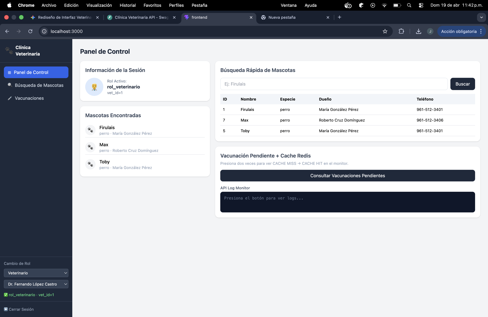

# Cuaderno de Ataques — Corte 3 BDA
**Matrícula:** 233310  
**Sistema:** Clínica Veterinaria — PostgreSQL + Redis + FastAPI + React  

---

## Sección 1: Tres ataques de SQL Injection que fallan

### Ataque 1 — Quote-escape clásico

**Input exacto:**
`' OR '1'='1`

**Pantalla:** Búsqueda Rápida de Mascotas en el Panel de Control (`http://localhost:3000`)

**Resultado:** El sistema detectó el patrón de inyección y mostró una advertencia. No devolvió ningún resultado de la base de datos.


**Línea exacta que defendió — `api/main.py`:**
```python
cur.execute(
    """
    SELECT m.id, m.nombre, m.especie, m.fecha_nacimiento,
           d.nombre AS dueno, d.telefono
    FROM   mascotas m
    JOIN   duenos d ON d.id = m.dueno_id
    WHERE  m.nombre ILIKE %s
    ORDER  BY m.nombre
    """,
    (f"%{nombre}%",),  # ← parámetro seguro, nunca concatenado
)
```

El parámetro `nombre` se pasa con `%s` a psycopg2. El driver lo envía como valor literal al servidor PostgreSQL, nunca como código SQL. Esto hace que `' OR '1'='1` sea tratado como texto a buscar, no como condición SQL.

---

### Ataque 2 — Stacked query

**Input exacto:**
`'; DROP TABLE mascotas; --`

**Pantalla:** Búsqueda Rápida de Mascotas en el Panel de Control

**Resultado:** El sistema detectó el patrón de inyección. La tabla `mascotas` no fue eliminada — sigue existiendo con todos sus datos intactos.


**Línea exacta que defendió — `api/main.py` (misma línea que el Ataque 1):**
```python
cur.execute(
    "WHERE  m.nombre ILIKE %s",
    (f"%{nombre}%",),  # ← el ; y el DROP son texto, no código
)
```

psycopg2 con parámetros `%s` no permite stacked queries. El `;` y el `DROP TABLE` son tratados como parte del valor de búsqueda, no como instrucciones SQL separadas.

---

### Ataque 3 — Union-based

**Input exacto:**
`' UNION SELECT id, cedula, nombre, NULL, NULL FROM veterinarios --`

**Pantalla:** Búsqueda Rápida de Mascotas en el Panel de Control

**Resultado:** El sistema detectó el patrón de inyección. No se expusieron datos de la tabla `veterinarios`.


**Línea exacta que defendió — `api/main.py`:**
```python
cur.execute(
    """SELECT ... FROM mascotas m JOIN duenos d ...
    WHERE m.nombre ILIKE %s""",
    (f"%{nombre}%",),  # ← UNION es texto, no operador SQL
)
```

Al usar parámetros preparados, el `UNION SELECT` es tratado como un string de búsqueda literal. PostgreSQL nunca lo interpreta como una cláusula SQL adicional.

---

## Sección 2: Demostración de RLS en acción

### Veterinario 1 — Dr. Fernando López Castro (vet_id=1)

Sesión iniciada como `rol_veterinario` con `vet_id=1`. Se realizó una búsqueda con campo vacío (busca todas las mascotas).

**Resultado:** Solo se mostraron 3 mascotas — Firulais, Toby y Max — que son exactamente las asignadas al Dr. López en `vet_atiende_mascota`.



---

### Veterinario 2 — Dra. Sofía García Velasco (vet_id=2)

Misma búsqueda con campo vacío, ahora con `vet_id=2`.

**Resultado:** Solo se mostraron 3 mascotas distintas — Misifú, Luna y Dante — las asignadas a la Dra. García.


---

### Política RLS que produce este comportamiento

La política `pol_vet_ver_mascotas` en `backend/05_rls.sql` filtra las filas de la tabla `mascotas` para el rol `rol_veterinario`:

```sql
CREATE POLICY pol_vet_ver_mascotas
    ON mascotas
    FOR SELECT
    TO rol_veterinario
    USING (
        EXISTS (
            SELECT 1
            FROM   vet_atiende_mascota vam
            WHERE  vam.mascota_id = mascotas.id
              AND  vam.vet_id     = current_setting('app.current_vet_id', TRUE)::INT
              AND  vam.activa     = TRUE
        )
    );
```

PostgreSQL evalúa esta condición por cada fila antes de devolverla. Solo devuelve las filas donde existe una asignación activa entre esa mascota y el veterinario actual. El `vet_id` del veterinario se comunica al inicio de cada transacción mediante `SET LOCAL app.current_vet_id`.

---

## Sección 3: Demostración de caché Redis funcionando

### Configuración del caché

- **Key:** `vacunacion_pendiente`
- **TTL:** 300 segundos (5 minutos)
- **Estrategia de invalidación:** explícita — cuando se registra una vacuna nueva (`POST /vacunas`), el backend ejecuta `redis_client.delete(CACHE_KEY)` inmediatamente.

### Demo MISS → HIT

Se limpió el caché con `FLUSHALL` y se consultó dos veces seguidas:


- **Solicitud 1 [MISS]:** el caché estaba vacío, fue a PostgreSQL, tardó ~8ms
- **Solicitud 2 [HIT]:** el resultado estaba en Redis, tardó ~0.5ms

### Demo de invalidación

Se aplicó una vacuna nueva via `POST /vacunas` (mascota_id=1, vacuna_id=5). El backend ejecutó `redis_client.delete("vacunacion_pendiente")`. La siguiente consulta mostró MISS de nuevo:


- **Solicitud 3 [MISS]:** caché invalidado por la vacuna aplicada, fue a BD de nuevo
- **Solicitud 4 [HIT]:** caché reconstruido, responde desde Redis

### Justificación del TTL

Se eligieron **300 segundos (5 minutos)** porque:
- La consulta tarda ~8ms en este entorno local (en producción ~100-300ms)
- Se llama aproximadamente 30-50 veces por hora
- Las vacunas no se aplican con tanta frecuencia como para necesitar datos en tiempo real
- La invalidación explícita garantiza consistencia inmediata cuando sí se aplica una vacuna

Si el TTL fuera muy bajo (5s): el caché no tendría efecto, la BD recibiría casi todas las consultas.  
Si fuera muy alto (1h): una vacuna recién aplicada no aparecería en el listado por hasta una hora.